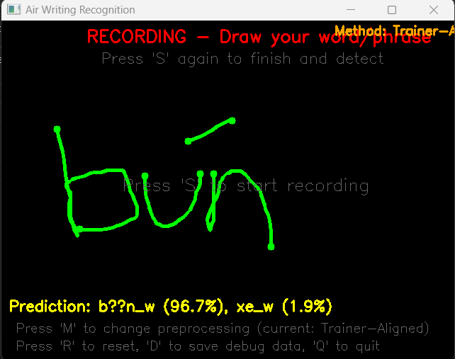
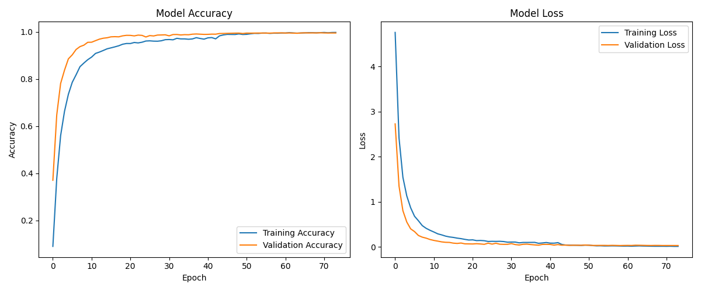

# Air Writing Recognition
A real-time handwriting recognition tool that uses mouse movements to recognize written characters and words.

# Authors
Tho Doan Le - tleeds1['https://github.com/tleeds1']

## Overview
This application allows users to "write in the air" using a mouse and predicts what was written using a pre-trained deep learning model. The system captures mouse trajectory data, preprocesses it, and passes it to a neural network for classification.



## Features
- Real-time drawing and recognition
- Multiple preprocessing methods for optimizing recognition
- Visual debugging tools for model performance analysis
- Support for multi-stroke drawing
- Advanced visualization of input features and model predictions

## Requirements
- Python 3.6+
- OpenCV
- NumPy
- Matplotlib
- TensorFlow
- joblib

## Installation 
```bash
# Clone the repository
git clone https://github.com/tleeds1/air_writing_recognizer.git
cd air-writing-recognition

# Install dependencies
pip install -r requirements.txt
```

## Usage
1. Ensure you have the trained model files:
   - `air_writing_model.h5` (the neural network model)
   - `model_metadata.joblib` (containing label mappings and preprocessing parameters)
2. Run the application: 
```bash
python mouse_drawing_recognizer.py
```
3. Controls:
   - Press `S` to start/stop recording
   - Press `R` to reset the canvas
   - Press `M` to cycle through preprocessing methods
   - Press `D` to save debug information
   - Press `Q` to quit

## Preprocessing Methods
The system supports multiple preprocessing methods for optimizing recognition:
1. **Basic**: Simple normalization of coordinates
2. **Normalized**: Normalized with aspect ratio preservation
3. **Stroke-aware**: Handles multi-stroke inputs
4. **Bypass Scaler**: Alternative normalization that bypasses the scaler
5. **Trainer-Aligned**: Matches the exact preprocessing used during training (recommended)

## Training Results
Our model has been trained on a diverse dataset of handwriting samples to ensure accurate recognition across different writing styles.



## Debug Output
When pressing the `D` key, the system saves analytical data to the `debug_output` folder:
- Raw trajectory data
- Visualization of preprocessing steps
- Comparison of different preprocessing methods
- Feature distributions and transformations

## Model Training
This application requires a pre-trained model. The model should be trained on handwriting data with the following features:
- Normalized X,Y coordinates
- Velocity features (changes in X,Y)
- Support for variable-length trajectories

## License
MIT

## Contributing
Contributions are welcome! Please feel free to submit a Pull Request.